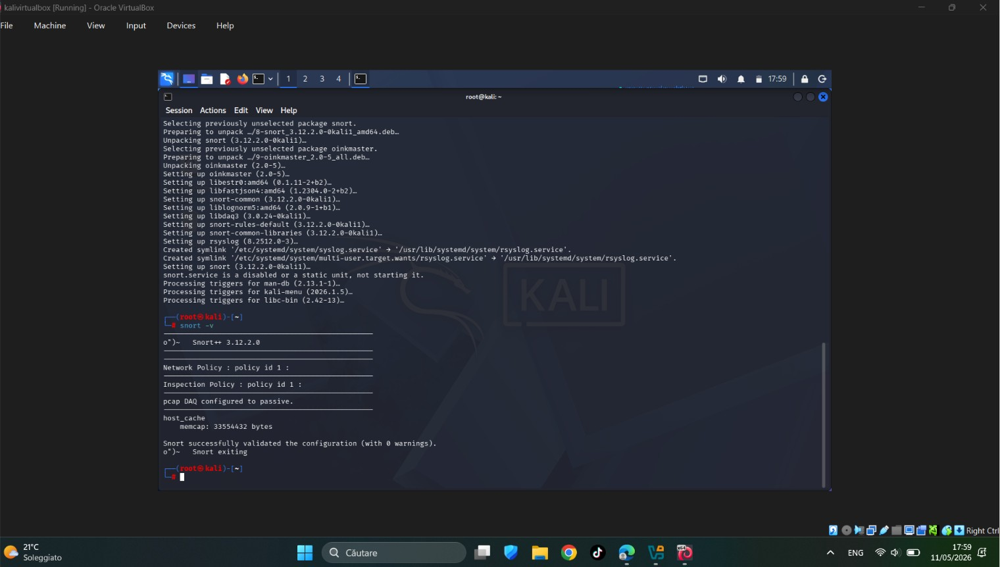
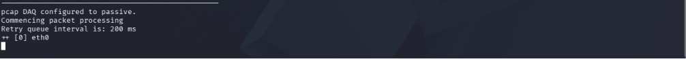
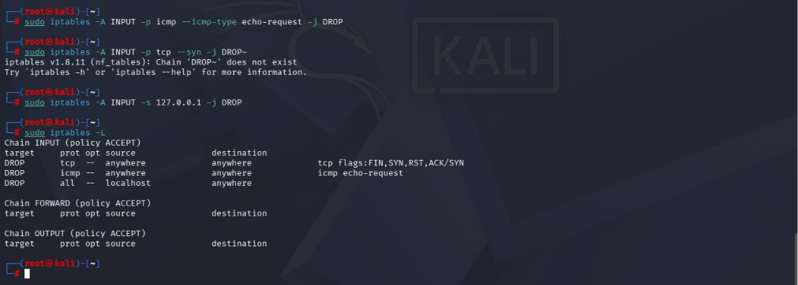
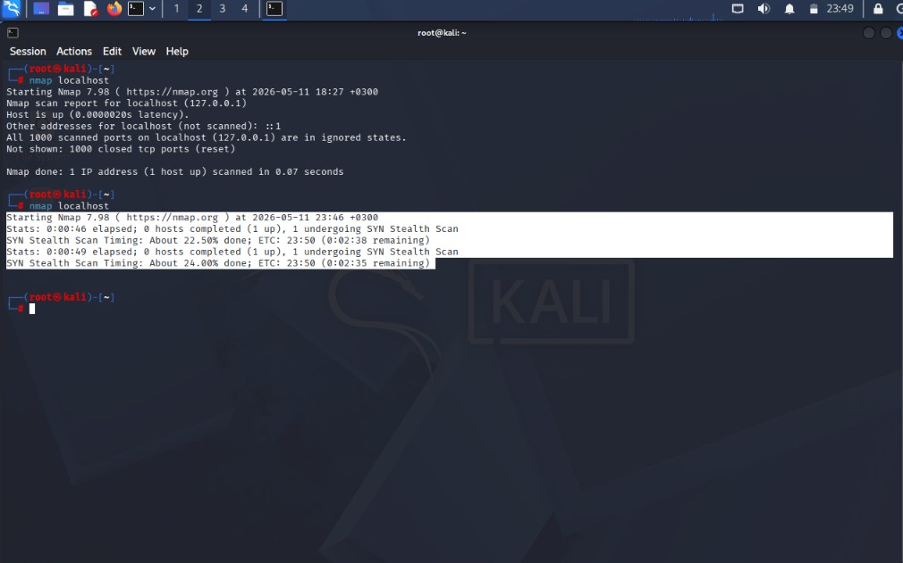

# Snort IDS Detection Lab

Basic IDS detection and attack mitigation lab using Snort, Nmap, Kali Linux, and iptables.

This project demonstrates beginner-level SOC analyst skills by simulating suspicious network activity, detecting scans using the Snort Intrusion Detection System (IDS), and applying firewall rules to mitigate potentially malicious traffic.

The lab was performed inside a Kali Linux virtual machine using local traffic simulation and basic defensive security techniques.

---

# Skills Demonstrated

- Linux terminal usage
- IDS monitoring
- Network traffic analysis
- Attack simulation
- Snort configuration
- Nmap reconnaissance scanning
- Firewall mitigation with iptables
- Security event investigation
- Basic incident response

---

# Environment

- Kali Linux
- VirtualBox
- Snort IDS
- Nmap
- iptables
# Snort Installation Verification

```bash
snort -V
```



This output confirms that Snort 3 was successfully installed on Kali Linux and that the IDS engine is available for network traffic monitoring and analysis.

---

# Snort Configuration Validation

![Snort Validation]
)

The Snort configuration was successfully validated, confirming that the IDS modules, rule sets, and packet inspection engine were correctly initialized before starting traffic analysis.

---

# Initial Nmap Reconnaissance Scan

```bash
nmap localhost
```


 )

This scan simulates basic reconnaissance activity against the localhost system before defensive firewall rules were applied.

---

# Snort Detection and Traffic Monitoring



Snort monitored local network traffic and detected suspicious scanning activity generated during the Nmap reconnaissance simulation.

---

# Firewall Mitigation Rules

```bash
sudo iptables -L
```



Firewall rules were added using iptables to block suspicious localhost scanning activity and restrict potentially malicious TCP SYN traffic.

---

# Blocked Nmap Scan After Mitigation

```bash
nmap localhost
```



After applying the firewall mitigation rules, the Nmap scan became significantly slower and less effective, demonstrating successful traffic restriction and defensive filtering.
